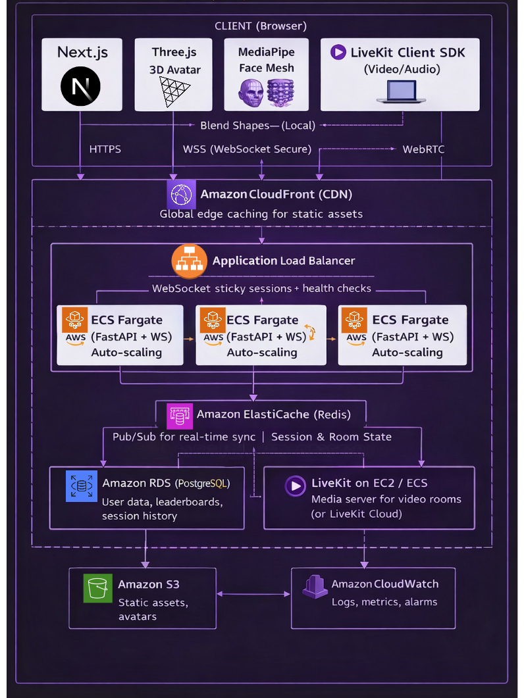

# Convex

**"Gamifying Focus with Affective Computing."**
A V-Tuber style studyverse where your face controls the game, processed 100% locally for total privacy.

## Table of Contents

- [About the Project](#about-the-project)
- [The Problem](#the-problem)
- [System Architecture](#system-architecture)
- [Privacy Architecture](#privacy--security-the-edge-ai-advantage)
- [Key Features](#current-features-mvp)
- [Scalability & Reliability](#scalability--reliability)
- [Features for Round 2](#roadmap-round-2-updates)
- [Tech Stack](#tech-stack)
- [Team Contributions](#team-contributions)
- [Getting Started](#getting-started)

## About the Project

**Convex** is a next-generation study environment that solves the isolation of remote learning without compromising privacy. By leveraging **Edge AI**, we turn a standard study session into a multiplayer RPG experience.

Instead of broadcasting video (invasive and bandwidth-heavy), Convex tracks facial landmarks locally to animate a **3D Avatar** in real-time. If you focus, your avatar focuses. If you get distracted, your avatar falls asleep, and your game stats drop.

## The Problem

Traditional study apps (Yeolpumta, Forest) and tools (Zoom, Discord) suffer from three critical flaws:

1. **Passive Tracking:** Users can start a timer and scroll on their phone. Apps reward "Time Spent" rather than "True Focus."
2. **Digital Loneliness:** Studying alone kills motivation, but always-on video calls cause fatigue and feel invasive.
3. **Burnout Cycles:** Users set unrealistic goals (e.g., "10 hours today"), fail, and quit entirely.

## Userflow Diagram


## System Architecture

### Production Architecture (AWS)




### AWS Services Used

| AWS Service             | Purpose                              | Why We Chose It                                                  |
| ----------------------- | ------------------------------------ | ---------------------------------------------------------------- |
| **CloudFront**          | CDN for Next.js static assets        | Global edge locations reduce latency for users worldwide         |
| **ALB**                 | Load balancer with WebSocket support | Sticky sessions ensure Socket.IO connections stay on same server |
| **ECS Fargate**         | Serverless container hosting         | No server management; auto-scales based on CPU/connections       |
| **ElastiCache (Redis)** | Pub/Sub + session state              | Cross-server event sync for timer broadcasts                     |
| **RDS PostgreSQL**      | Persistent data storage              | Managed database with automated backups                          |
| **S3**                  | Static file storage                  | Avatar assets, user uploads                                      |
| **CloudWatch**          | Monitoring & logging                 | Real-time metrics, error tracking, auto-scaling triggers         |
| **Route 53**            | DNS management                       | Health checks + failover routing                                 |

### Key Design Decisions

| Decision                | Rationale                                             |
| ----------------------- | ----------------------------------------------------- |
| **Edge AI (MediaPipe)** | Zero video uploads = privacy + bandwidth savings      |
| **Absolute timestamps** | `endTime` instead of `remaining` prevents timer drift |
| **WebSocket transport** | Skip HTTP polling for lower latency                   |
| **LiveKit SFU**         | Mesh WebRTC fails at 4-5 users; SFU scales to 10+     |
| **Blend shape relay**   | Only 52 floats per frame vs full video stream         |
| **ECS Fargate**         | Serverless containers = no EC2 management overhead    |
| **ElastiCache Redis**   | Sub-millisecond pub/sub for real-time sync            |

## Current Features

### 1. The Avatar

The core of our platform is a bio-mirror that provides real-time feedback.

- **Real-Time Mimicry:** The avatar mirrors your head movements and expressions with low latency.
- **Distraction Guard:** If the Edge AI detects you looking at a phone or away from the screen for **>15 seconds**, the avatar "falls asleep," and your session timer automatically pauses.

### 2. Competitive Rooms

Gamifying the group study experience.

- **The Mechanic:** Join a group with 4+ friends. The group's collective Focus Time deals damage to a "Boss Monster."

## Features for Round 2

We are moving from _Tracking Focus_ to _Optimizing Habits_.

### 3. Local Focus Verification

- **Confusion Detection:** The app detects "Furrowed Brow" micro-expressions to tag sessions as "High Cognitive Load," giving you data on which subjects are actually hardest for you.

- **The Penalty:** If one user gets distracted (detected by AI), the group's **DPS (Damage Per Second)** drops. This creates positive peer pressure to stay focused.

- **Ghost Mode (Async Multiplayer):** Study alongside the "Ghost" of a friend's previous session (recorded metadata, not video).

- **Streaks:** The app will give user the option of setting their own limits, as the user can decide how many hours a day would be eligible for maintaining the streak.

## Privacy & Security

We utilize a **Zero-Trust Video Architecture**. We understand that students are privacy-conscious, which is why Convex is built to ensure your camera feed never leaves your device.

- **100% On-Device Processing:** All facial analysis (Blink Rate, Gaze Tracking, Emotion Detection) runs locally in your browser using **MediaPipe via WebAssembly**.
- **No Video Uploads:** Your camera feed is processed in RAM and discarded instantly.

## Tech Stack

| Component     | Technology                | Description                          |
| ------------- | ------------------------- | ------------------------------------ |
| **Frontend**  | Next.js 14 (App Router)   | UI/UX and State Management           |
| **Rendering** | Three.js                  | 3D Avatar Rendering and Animation    |
| **AI Engine** | TensorFlow.js / MediaPipe | Face Mesh and Gaze tracking (Edge)   |
| **Backend**   | Python FastAPI            | API and Logic                        |
| **Real-Time** | python-socketio           | JSON Coordinate Sync for Multiplayer |
| **Video**     | LiveKit                   | Optional video rooms                 |

---

## Scalability & Reliability

### How We Handle Growth

```
            CURRENT (MVP)                              AWS PRODUCTION
      ┌─────────────────────┐              ┌─────────────────────────────────────┐
      │   Single Server     │              │         AWS Cloud                   │
      │  ┌───────────────┐  │              │  ┌─────────────────────────────┐   │
      │  │ FastAPI +     │  │              │  │     CloudFront (CDN)        │   │
      │  │ Socket.IO     │  │              │  └──────────────┬──────────────┘   │
      │  └───────────────┘  │              │                 │                  │
      │                     │              │  ┌──────────────▼──────────────┐   │
Users─►│  In-Memory State   │    Users ───►│  │    ALB (Sticky Sessions)    │   │
      └─────────────────────┘              │  └──────────────┬──────────────┘   │
                                           │       ┌─────────┼─────────┐        │
                                           │  ┌────▼────┐┌───▼───┐┌────▼────┐  │
                                           │  │Fargate 1││Farg. 2││Fargate 3│  │
                                           │  │(FastAPI)││       ││         │  │
                                           │  └────┬────┘└───┬───┘└────┬────┘  │
                                           │       └─────────┼─────────┘       │
                                           │                 ▼                  │
                                           │  ┌─────────────────────────────┐  │
                                           │  │   ElastiCache (Redis)       │  │
                                           │  │   Pub/Sub + Room State      │  │
                                           │  └─────────────────────────────┘  │
                                           │                 │                  │
                                           │  ┌──────────────▼──────────────┐  │
                                           │  │      RDS PostgreSQL         │  │
                                           │  │   (Multi-AZ, Read Replicas) │  │
                                           │  └─────────────────────────────┘  │
                                           └───────────────────────────────────┘
```

| Challenge                     | MVP Solution             | AWS Production Solution                            |
| ----------------------------- | ------------------------ | -------------------------------------------------- |
| **Timer sync across servers** | Single server (no issue) | ElastiCache Redis pub/sub for cross-server sync    |
| **Room state**                | In-memory dict           | Redis hash per room in ElastiCache                 |
| **10+ video participants**    | LiveKit self-hosted      | LiveKit on EC2 Auto Scaling Group or LiveKit Cloud |
| **Blend shape relay**         | Broadcast to room        | Redis streams + sharded rooms                      |
| **Database**                  | SQLite                   | RDS PostgreSQL Multi-AZ + read replicas            |
| **Static assets**             | Next.js server           | S3 + CloudFront CDN                                |
| **SSL/TLS**                   | Local dev                | ACM certificates + ALB termination                 |
| **Auto-scaling**              | Manual                   | ECS Service Auto Scaling (CPU/memory targets)      |

### Failure Handling (AWS)

| Failure Mode           | AWS Detection                       | Recovery Strategy                                       |
| ---------------------- | ----------------------------------- | ------------------------------------------------------- |
| **Container crash**    | ALB health checks + ECS task health | ECS auto-replaces unhealthy tasks; ALB reroutes traffic |
| **Server overload**    | CloudWatch CPU/Memory alarms        | ECS auto-scaling adds Fargate tasks                     |
| **Database failure**   | RDS Multi-AZ automatic failover     | Standby promoted in <60s; connection string unchanged   |
| **Redis failure**      | ElastiCache Multi-AZ                | Automatic failover to replica node                      |
| **Region outage**      | Route 53 health checks              | DNS failover to secondary region (DR setup)             |
| **Client disconnect**  | Socket `disconnect` event           | Session preserved in Redis for 60s reconnect window     |
| **Timer drift**        | N/A (absolute timestamps)           | Clients self-correct using `endTime - Date.now()`       |
| **Face tracking loss** | MediaPipe confidence < 0.5          | Avatar freezes; resumes when face detected              |
| **DDoS attack**        | AWS Shield + WAF                    | Automatic mitigation at CloudFront edge                 |

### Why This Architecture Works

1. **Stateless containers** - FastAPI on ECS Fargate; all state in ElastiCache Redis
2. **Event-driven sync** - No polling; server pushes updates via WebSocket through ALB
3. **Edge-heavy compute** - Face tracking runs on client = server only relays tiny payloads
4. **Graceful degradation** - Video optional; app works with just avatars + timers
5. **Multi-AZ resilience** - Database and cache replicated across availability zones
6. **Global CDN** - CloudFront serves static assets from nearest edge location

### Cost Optimization

| Strategy                   | Implementation                                 | Estimated Savings       |
| -------------------------- | ---------------------------------------------- | ----------------------- |
| **Fargate Spot**           | Use Spot capacity for non-critical tasks       | Up to 70% on compute    |
| **Reserved Instances**     | 1-year commitment for RDS & ElastiCache        | ~30-40% vs on-demand    |
| **S3 Intelligent-Tiering** | Auto-move infrequent assets to cheaper storage | ~40% on storage         |
| **CloudFront caching**     | Cache static assets at edge                    | Reduced origin requests |

---

## Team Contributions

| Team Member    | Role           | Contributions                                                                        |
| -------------- | -------------- | ------------------------------------------------------------------------------------ |
| **[Member 1]** | Frontend Lead  | Next.js setup, React components, Tailwind styling, timer UI, distraction overlay     |
| **[Member 2]** | Backend Lead   | FastAPI server, Socket.IO handlers, room management, timer broadcast logic           |
| **[Member 3]** | 3D/AI Engineer | Three.js avatar rendering, MediaPipe integration, blend shape mapping, face tracking |
| **[Member 4]** | Infrastructure | LiveKit setup, deployment config, WebSocket optimization, testing                    |

### Collaboration Workflow

- **Communication**: Discord for daily standups
- **Version Control**: GitHub with feature branches + PR reviews
- **Task Tracking**: GitHub Issues + Projects board
- **Docs**: Shared Notion for research notes

---

## Getting Started

### Prerequisites

- **Node.js** (v18+) and **pnpm**
- **Python** (3.10+)
- **uv**: `curl -LsSf https://astral.sh/uv/install.sh | sh`

### Installation

1. **Clone the repository**

```bash
git clone https://github.com/ManishG04/Convex
cd Convex
```

2. **Install frontend dependencies**

```bash
pnpm install
```

3. **Install backend dependencies**

```bash
cd backend
uv sync
```

### Configuration

Create `.env` files:

**Root `.env`** (for Next.js frontend):

```bash
NEXT_PUBLIC_SOCKET_URL="http://localhost:3001"

# Optional: LiveKit for video
LIVEKIT_API_KEY=
LIVEKIT_API_SECRET=
LIVEKIT_URL=
```

**`backend/.env`** (for FastAPI):

```bash
FRONTEND_URL=http://localhost:3000
SOCKET_PORT=3001
```

### Running the Application

**1. Start the Python backend**:

```bash
cd backend
uv run python -m uvicorn app.main:socket_app --reload --port 3001
```

**2. Start the Next.js frontend** (in root directory):

```bash
pnpm dev
```

**3. Open** http://localhost:3000

### API Documentation

Once the backend is running:

- Swagger UI: **`http://127.0.0.1:3001/docs`**
- Redoc: **`http://127.0.0.1:3001/redoc`**

### Managing Backend Packages

```bash
cd backend
uv add package_name
uv remove package_name
```
