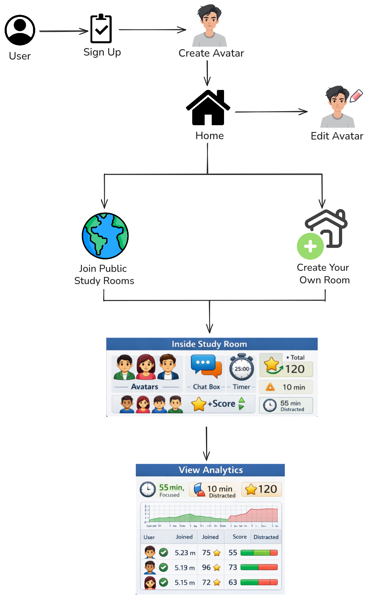

# Convex

**"Gamifying Focus with Affective Computing."**
A V-Tuber style studyverse where your face controls the game, processed 100% locally for total privacy.


## Table of Contents

* [About the Project](#about-the-project)
* [The Problem](#the-problem)
* [User Flow Diagram](#userflow-diagram)
* [Key Features](#current-features)
* [Features for Round 2](#features-for-round-2)
* [Privacy Architecture](#privacy--security)
* [Tech Stack](#tech-stack)
* [Getting Started](#getting-started)


## About the Project

**Convex** is a next-generation study environment that solves the isolation of remote learning without compromising privacy. By leveraging **Edge AI**, we turn a standard study session into a multiplayer RPG experience.

Instead of broadcasting video (invasive and bandwidth-heavy), Convex tracks facial landmarks locally to animate a **3D Avatar** in real-time. If you focus, your avatar focuses. If you get distracted, your avatar falls asleep, and your game stats drop.


## The Problem

Traditional study apps (Yeolpumta, Forest) and tools (Zoom, Discord) suffer from three critical flaws:

1. **Passive Tracking:** Users can start a timer and scroll on their phone. Apps reward "Time Spent" rather than "True Focus."
2. **Digital Loneliness:** Studying alone kills motivation, but always-on video calls cause fatigue and feel invasive.
3. **Burnout Cycles:** Users set unrealistic goals (e.g., "10 hours today"), fail, and quit entirely.

## Userflow Diagram


## Current Features

### 1. The Avatar

The core of our platform is a bio-mirror that provides real-time feedback.
 
* **Real-Time Mimicry:** The avatar mirrors your head movements and expressions with low latency.
* **Distraction Guard:** If the Edge AI detects you looking at a phone or away from the screen for **>15 seconds**, the avatar "falls asleep," and your session timer automatically pauses.

### 2. Competitive Rooms

Gamifying the group study experience.

* **The Mechanic:** Join a group with 4+ friends. The group's collective Focus Time deals damage to a "Boss Monster."


## Features for Round 2
We are moving from *Tracking Focus* to *Optimizing Habits*.

### 3. Local Focus Verification

* **Confusion Detection:** The web-app will detects expressions to tag session's cognitive load giving the user data in which session the user struggles the most.

* **The Penalty:** If one user gets distracted (detected by AI), the group's **DPS (Damage Per Second)** drops. This creates positive peer pressure to stay focused.


* **Ghost Mode (Async Multiplayer):** Study alongside the "Ghost" of a friend's previous session (recorded metadata, not video).

* **Streaks:** The app will give user the option of setting their own limits, as the user can decide how many hours a day would be eligible for maintaining the streak.


## Privacy & Security

We utilize a **Zero-Trust Video Architecture**. We understand that students are privacy-conscious, which is why Convex is built to ensure your camera feed never leaves your device.

* **100% On-Device Processing:** All facial analysis (Blink Rate, Gaze Tracking, Emotion Detection) runs locally in your browser using **MediaPipe via WebAssembly**.
* **No Video Uploads:** Your camera feed is processed in RAM and discarded instantly.


## Tech Stack

| Component | Technology | Description |
| --- | --- | --- |
| **Frontend** | React.js | UI/UX and State Management |
| **Rendering** | Three.js | 3D Avatar Rendering and Animation |
| **AI Engine** | TensorFlow.js / MediaPipe | Face Mesh and Gaze tracking (Edge) |
| **Backend** | Python-FastAPI | API and Logic |
| **Real-Time** | Socket.io | JSON Coordinate Sync for Multiplayer |
| **Database** | MongoDB | User stats and session metadata |

---

## Getting Started

Follow these instructions to get a local copy of the project up and running using [uv](https://github.com/astral-sh/uv).

### Prerequisites

* **uv** installed on your system.
* *macOS/Linux:* `curl -LsSf https://astral.sh/uv/install.sh | sh`
* *Windows:* `powershell -c "irm https://astral.sh/uv/install.ps1 | iex"`


### Installation

1. **Clone the repository**
```bash
git clone https://github.com/ManishG04/Convex
cd Convex
```


2. **Sync Dependencies**
`uv` will automatically create a virtual environment and install the locked dependencies.
```bash
uv sync
```


### Configuration

Create a `.env` file in the root directory to store your environment variables.

```bash
cp .env.example .env
```

### Running the Application

You can use `uv run` to execute the server within the project's environment automatically:

```bash
uv run uvicorn main:app --reload
```

### Managing Packages

* **Add a new package:**
```bash
uv add package_name
```


* **Remove a package:**
```bash
uv remove package_name
```


### API Documentation

Once the server is running, access the docs at:

* Swagger UI: **`http://127.0.0.1:8000/docs`**
* Redoc: **`http://127.0.0.1:8000/redoc`**